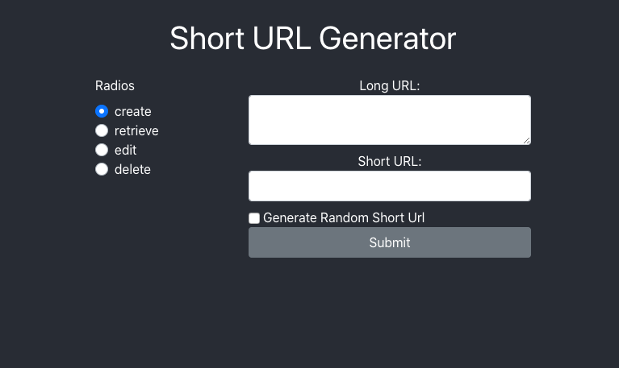

# URL Shortener Project

Allows a User to input a long URL and a custom or random short URL (beginning with my heroku url) will be returned. The user can create/update/retrieve/delete the long URL/short URL pair.

https://dashboard.heroku.com/apps/web-dev-a4-leah

